<div align="center">

# Monster Hunter Villager

**A trap-throwing, knife-wielding villager profession for Minecraft 1.21.1 (NeoForge)**


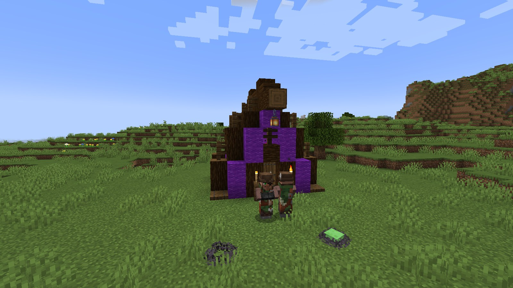

</div>

A port of Yoshi's [Monster Hunter Villager](https://www.curseforge.com/minecraft/mc-mods/monster-hunter-villager)
(Forge 1.20.1) to NeoForge 1.21.1, **rewritten so it no longer lags your game**. The original ran its
hunter and trap code on every mob in the world, every tick, and players measured it taking 12-15%
of their server's tick time. This version only runs for Monster Hunters and placed traps, and plays
the same. See [Performance](#performance).

## Features

### The Monster Hunter

Any villager can take the job at a **Hunter's Workbench**. Monster Hunters look after a village:
they hunt nearby monsters, set traps, and trade in monster loot and hunting gear.

<p align="center">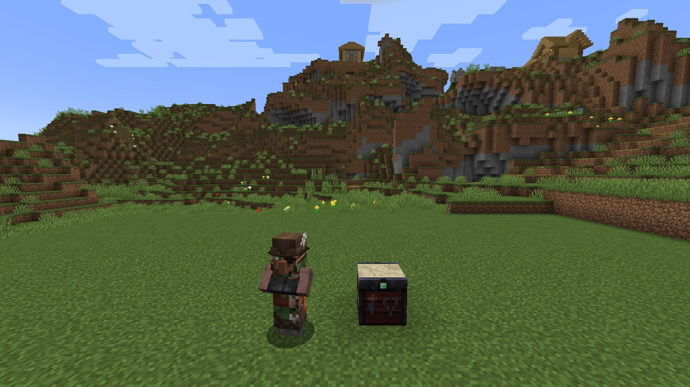</p>

### Hunting

A Monster Hunter spots zombies (husks and drowned too), spiders, skeletons, strays and slimes within
15 blocks. It throws a **sticky trap** to pin its quarry, follows up with **sharpened traps** once
it's stuck, keeps a few blocks away while it works, and picks its own traps back up when the fight
is over. Other mods and datapacks can give it more to hunt through the `monster_hunter_villager:quarry`
entity tag.

<p align="center">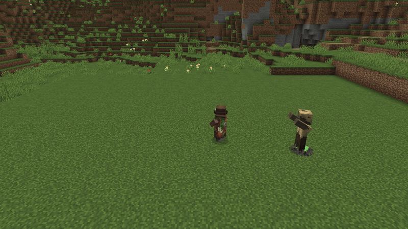</p>

<table>
<tr>
<td width="50%"><b>Up close</b>, it switches to its Hunter's Knife.<br>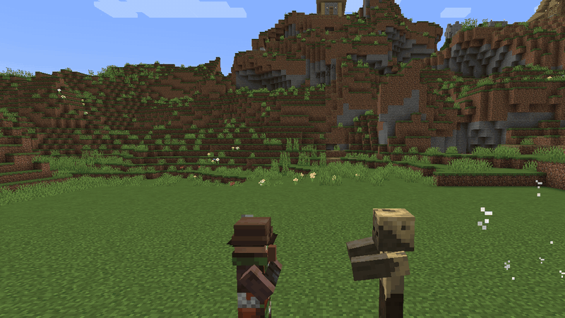</td>
<td width="50%"><b>Shot at</b>, it dodges half of the incoming arrows in a puff of cloud, then turns on whoever fired.<br>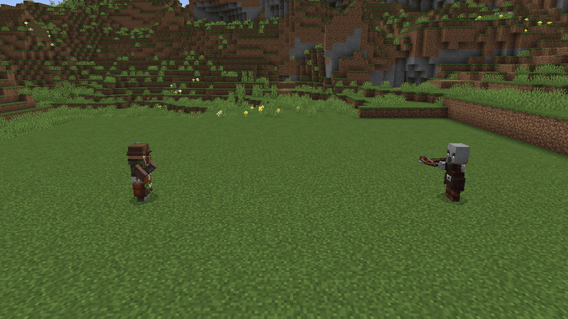</td>
</tr>
</table>

Hurt it and you become its quarry (unless you're in creative or spectator mode). When its health
drops below a third, it drinks a potion of healing.

### Traps

Three traps, all thrown. They land where they hit, wear out as their victims struggle, and fall
apart after two and a half minutes.

<table>
<tr>
<td width="50%"><b>Sticky Trap</b>: glues whatever steps in it in place. The bigger the victim, the weaker the hold.<br>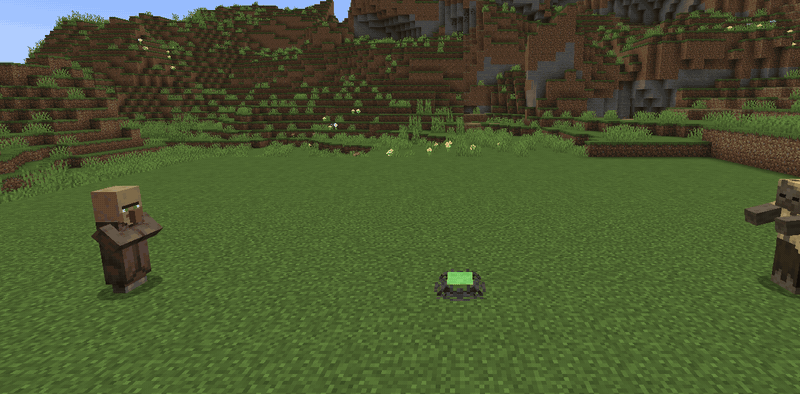</td>
<td width="50%"><b>Sharpened Trap</b>: cuts whatever struggles in it (harder the more wounded it already is) and slows it down.<br>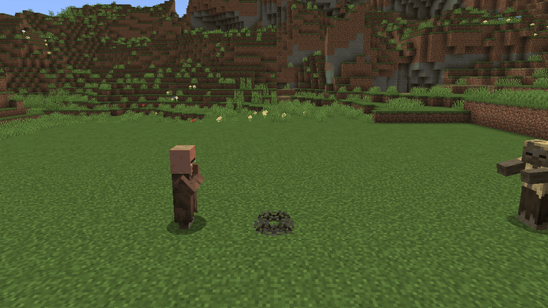</td>
</tr>
<tr>
<td width="50%"><b>Soul Chain Trap</b>: drags everything nearby toward it on chains of soul fire and holds it there. It never touches whoever threw it.<br>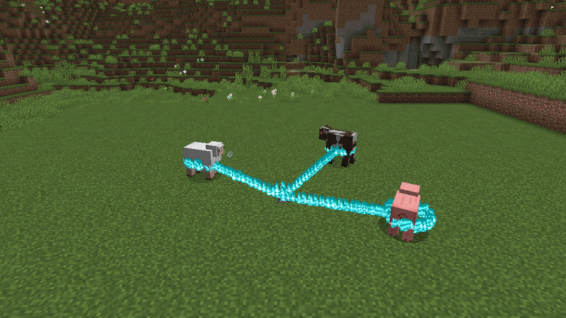</td>
<td width="50%"><b>Throw your own</b>: right-click to throw (3 second cooldown). Right-click a trap you threw to pick it back up.<br>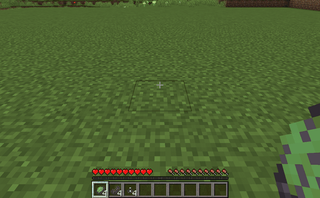</td>
</tr>
</table>

<p align="center">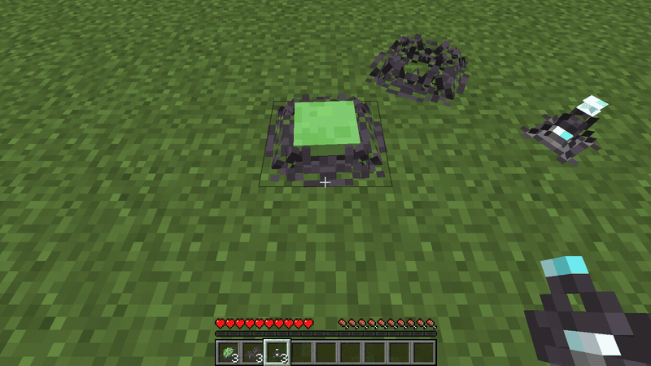</p>

At night the soul chain glows.

<p align="center">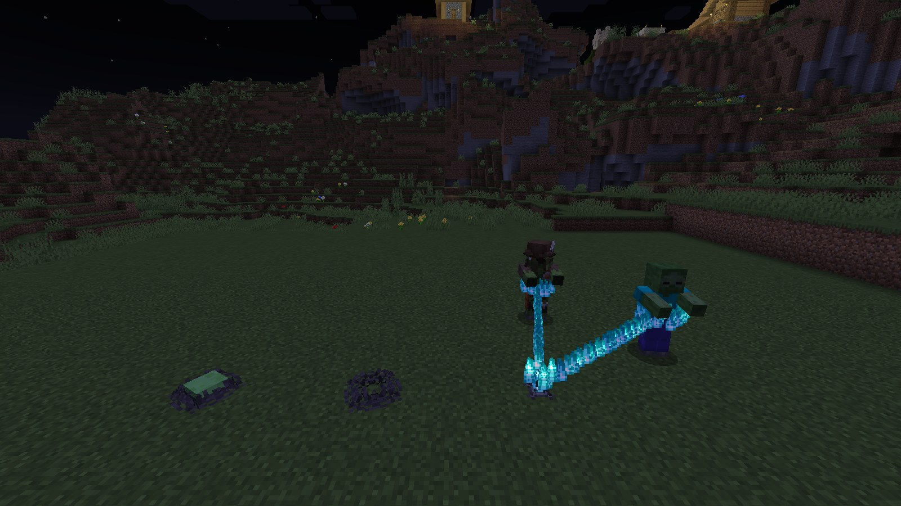</p>

### The Hunter's Workbench

Put a **Trap Prototype** in the bottom slot and an ingredient on top. The map shows a live 3D
preview of the trap you're making.

| Trap Prototype + | Makes |
|---|---|
| Slime Ball | Sticky Trap |
| Hunter's Knife | Sharpened Trap |
| Soul Lantern | Soul Chain Trap |

<p align="center">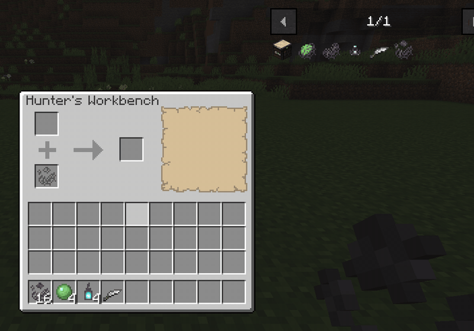</p>

The workbench itself is crafted from a map and an emerald on top of four planks. Trap recipes are
ordinary recipe files, so datapacks can add more. With [JEI](https://www.curseforge.com/minecraft/mc-mods/jei)
installed, they show up there too.

<table>
<tr>
<td width="50%">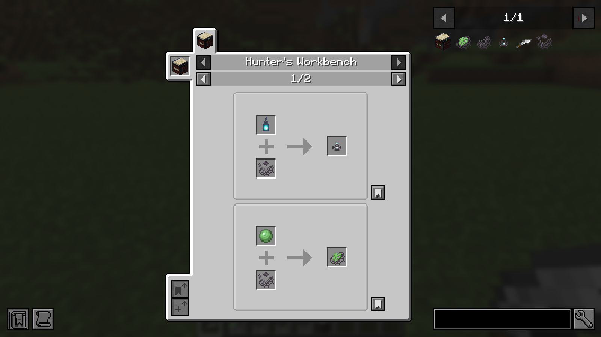</td>
<td width="50%">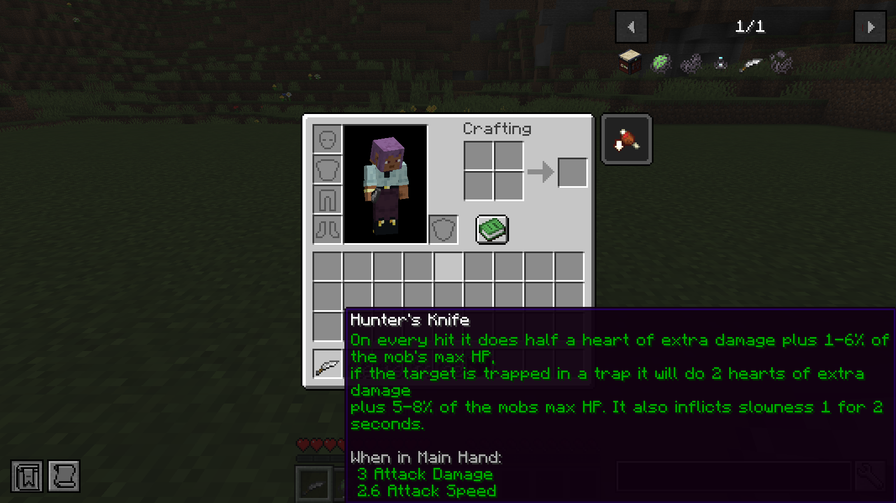</td>
</tr>
</table>

Trap Prototypes and the knife come from Monster Hunters. They buy monster drops (rotten flesh,
bones, spider eyes, slime balls, phantom membranes and more) and sell prototypes, traps, the
Hunter's Knife, bows, crossbows and spectral arrows. At master level they trade in wither skulls,
dragon's breath, nether stars and even the dragon egg.

<p align="center">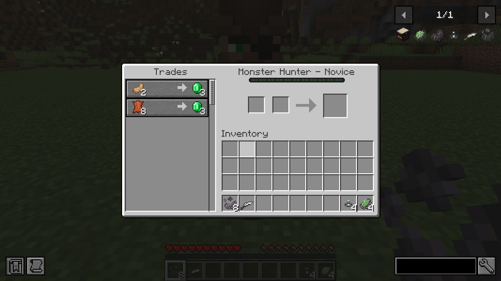</p>

### Hunter tents

Hunter tents generate on their own in plains, forests, taigas, savannas, meadows and snowy plains.
Each has a workbench and a villager who soon takes the job. They come in nine colours.

<p align="center">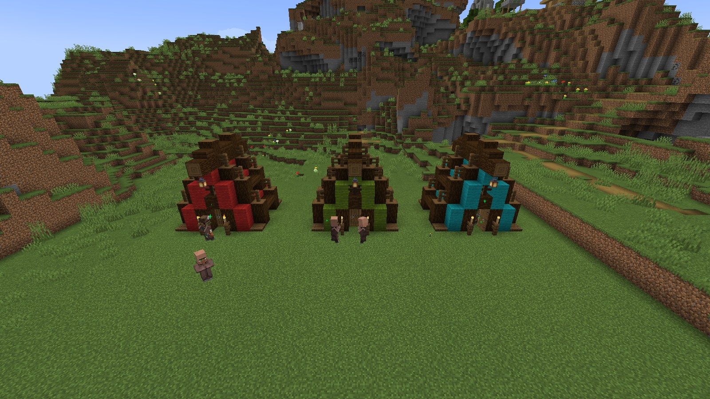</p>

## Performance

Mean server tick time for the same scene, with and without the mod (lower is better):

<picture>
  <source media="(prefers-color-scheme: dark)" srcset="docs/media/performance-dark.svg">
  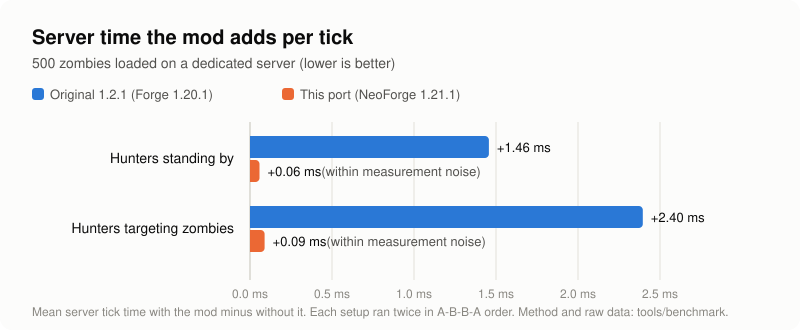
</picture>

| Scene | Forge 1.20.1, no mod | With the original | NeoForge 1.21.1, no mod | With this port |
|---|---|---|---|---|
| 500 zombies, 4 Monster Hunters standing by | 2.19 ms | 3.64 ms (**+1.46 ms, +67%**) | 1.58 ms | 1.63 ms (+0.06 ms) |
| 500 zombies, 8 Monster Hunters targeting them | 2.20 ms | 4.60 ms (**+2.40 ms, +109%**) | 1.69 ms | 1.78 ms (+0.09 ms) |

The original made the server do 67-109% more work in these scenes, and its cost grows with every
mob loaded. Two identical runs without any mod came out up to 0.34 ms apart, more than this port
adds, so its cost is too small to measure here. A Java Flight Recorder profile with 500 zombies
loaded found no samples in the mod's code (0 of 322 server-thread samples).

These are server numbers. The original also ran its per-mob code on every player's client. This
port runs nothing per mob on the client, so that cost is gone too, but it wasn't benchmarked.

How it was measured: dedicated servers (Forge 1.20.1-47.4.2 on Java 17, NeoForge 21.1.248 on Java
21, 4 GB heap), flat world, night, natural spawning off. Zombies and hunters have `NoAI` so every
run is identical, and the mods' per-tick code still runs for them. Each configuration ran twice in
A-B-B-A order, and each run took 12 samples of the server's own 100-tick average. No zombie or
hunter died during any run. Scripts and raw results are in [tools/benchmark](tools/benchmark).

## Installing

Needs Minecraft 1.21.1 with NeoForge 21.1.77 or newer (tested on 21.1.77 and 21.1.248). Download the
jar from [Releases](../../releases) and put it in your `mods` folder. JEI is optional. The mod is in
English and Brazilian Portuguese.

## Changes from the original

### Small fixes

- A hunter's knife now counts as the hunter's attack. Before, the game credited the damage to the
  victim itself ("Zombie was slain by Zombie") and knocked the victim in a random direction.
- A soul chain trap you throw no longer flashes a chain to you (and gives you a tug) the moment it
  lands. The trap used to find out who threw it a tick too late.
- The Hunter's Workbench crafts from its recipe files, so datapacks can add or change trap recipes.
- A hunter standing almost exactly in line with its target (same x or z, to within a thousandth
  of a block) wouldn't throw a trap at it, because a number-formatting trick in the original turned
  the distance into thousands of blocks. Fixed.
- In creative mode, throwing a trap no longer uses it up.
- `/kill` removes traps. Traps refill their health every tick, so a kill used to leave them stuck
  mid-death.
- The workbench no longer has a hidden inventory that hoppers could reach. It was emptied every
  time the screen closed anyway, so nothing is lost.

### Kept as in the original, on purpose

- A hunter picks the **farthest** monster within 15 blocks as its target, not the nearest. It
  only picks monsters that are under open sky when it is, or under cover when it is.
- Players caught by a soul chain trap are pulled twice as hard as mobs.
- The knife's bonus damage lands right after the normal hit, while the target is still briefly
  immune, so only the part that exceeds the normal hit gets through, often nothing.
- Light gray tents use the gray tent design, and the sharpened trap uses the plain trap texture.

### Known limitations

- A Monster Hunter riding a boat or minecart doesn't hunt until it gets off (NeoForge doesn't send
  the per-entity tick event for passengers).
- Upgrading a 1.20.1 world has not been tested. All block, item, entity, recipe and profession IDs
  are unchanged, so the content itself carries over. Hunters forget their current target, and
  placed traps reset their wear.

## For developers

### Where the original's time went, and what replaced it

| Original (1.20.1) | This port |
|---|---|
| A `LivingTickEvent` handler ran for every living entity, every tick, on the server and on every client. | Hunter logic runs from `EntityTickEvent.Pre`, server-side, and leaves after one `instanceof Villager` check for everything else. |
| To tell whether a mob was a Monster Hunter, it serialised the whole mob to NBT (`saveWithoutId`) every tick. | Reads `villager.getVillagerData().getProfession()`. |
| Every entity ran up to 15 sorted searches for soul chain traps within 4.5 blocks, plus a second copy of that logic for players. | Each soul chain trap finds its own victims, so the cost scales with the number of traps, not the number of mobs. The chain particles are drawn client-side instead of 20 particle packets per victim per tick. |
| A hunter with a target re-found it every tick by collecting and sorting every entity in a 600x600x600 box. | `ServerLevel.getEntity(uuid)` plus a range check. |
| Turning to face a target ran a `/tp @s ~ ~ ~ facing entity` command. | `lookAt()`, reproducing the command's side effects (stop pathing, clear vertical motion). |
| A "trapped" counter was written into the saved NBT of every living entity and decremented every tick. | A transient, unsaved attachment holding an expiry game time, set only on entities a trap is holding. |
| Every placed trap searched an 800x800x800 box for players every tick. | Loops over `level.players()`. |
| The workbench recalculated its output every tick from a player-tick hook and consumed inputs through a client-to-server packet. | Output is recalculated when an input changes, and taking it consumes the inputs server-side. No custom packets. |
| The soul chain glow layer baked a new model every frame, and the workbench screen created a new entity every frame for its preview. | Both are created once and reused. |
| Every random roll created a new `RandomSource`. | Uses the entity's own random source. |

### Layout

- `hunter/`: the Monster Hunter AI (`MonsterHunterAI`), its saved state, and the combat rules it
  shares with the traps and the knife (trapped state, knife bonus).
- `entity/`: the traps (`AbstractTrapEntity`, the sticky, sharpened and soul chain traps, and the
  inert preview trap), the thrown-trap projectile, and `TrapKind` with the numbers that differ
  between trap types.
- `menu/`, `recipe/`, `block/`, `item/`: the Hunter's Workbench, its recipe type and the items.
- `client/`: renderers, models (geometry unchanged from the original) and the workbench screen.
- `compat/jei/`: the JEI plugin, loaded only when JEI is installed.

### Building and testing

```
gradlew build                                              # mod jar in build/libs
gradlew runGameTestServer                                  # 16 in-game tests, headless, on NeoForge 21.1.77
gradlew runGameTestServer -Pneo_version=21.1.248           # the same tests on a newer NeoForge
gradlew runClient -PwithJei=true
gradlew runClientTest -PwithJei=true -Pneo_version=21.1.248   # scripted visual check
gradlew runShowcase -PwithJei=true -Pneo_version=21.1.248     # records the media on this page
```

The jar is compiled against NeoForge 21.1.77, the oldest build it supports, so it uses nothing
newer. Mod-bus listeners are registered explicitly rather than with `@EventBusSubscriber` bus
auto-detection, which older 21.1 builds lack.

The GameTests live in `src/gametest` and never ship in the jar. They cover the job site, workbench
crafting, trap deployment and ownership, each trap's effect, trap pickup, the knife bonus, a
hunter finding and trapping a monster, a hunter going after a creature added through the quarry tag
(from a small test data pack) and ignoring one that isn't, retaliation, the tent templates upgrading
from 1.20.1, and that ordinary mobs get no data attached.

`runClientTest` and `runShowcase` open a game window and drive it from a script in `src/clienttest`
(also never shipped). The first saves a screenshot of every scene to `run/clienttest/screenshots`.
The second builds a plains world, finds a village and a hunter tent, stages every feature and saves
stills and GIF frames to `run/showcase/screenshots`. `python tools/media/make_media.py build` turns
those into the GIFs and pictures in `docs/media`, and `python tools/media/perf_chart.py` draws the
performance chart from the benchmark results.

## Credits and license

Original mod by **Yoshi**, released under the Academic Free License v3.0. This port is a derivative
work under the same license (see [NOTICE.md](NOTICE.md)). Textures, models, structures, the English
text and the trade table are the original author's. The Brazilian Portuguese translation was added
for this port.
